[TOC]

# 01、导入序列帧动画

原始动画资源：`Assets/Sprite/Player/PlayerSheet.png`

- **Sprite模式**：多个
- **每单位像素数**：16
- **过滤模式**：点（无过滤器）
- **压缩**：无

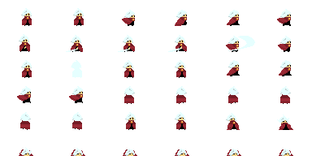

切割动画：

- 每个单元的尺寸：64×32像素

生成动画：

- 选择第1帧，拖入场景，生成原始人物`Player`
- 选择动画对应的多个序列帧，拖拽至人物身上，自动创建动画

# 02、角色：2D移动

地面素材：`Assets/Sprite/Ground.png`

- **每单位像素数**：16
- 此处使用一整张图表示一个地面，后续会改为Unity的tilemap功能制作地图

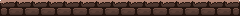

设置角色的`Tag`为：Player

为角色添加组件

- `Rigidbody 2D`：刚体组件，用于角色移动

  - **碰撞检测**：持续

  - **休眠模式**：从不休眠

  - **Constriants|冻结旋转**：冻结Z轴旋转（因为是2D游戏）

- `Capsule Collider 2D`：碰撞体组件，用于表示角色身体的碰撞
  - **是触发器**：不勾选

- `Box Collider 2D`：碰撞体组件，用于表示角色脚的碰撞
  - **是触发器**：勾选
- `PlayerController`：自定义脚本，控制角色移动

为地面添加组件

- `Box Collider 2D`：碰撞体组件，用于表示地面
  - **是触发器**：不勾选

添加脚本：`Assets/Scripts/PlayerController`，控制角色移动

- 通过`Input.GetAxis("Horizontal")`，获取水平移动方向
- 通过设置刚体组件的速度属性`rigidbody.velocity`，控制角色移动

# 03、角色：移动动画：Idle & Run

修改角色的Animator：

- Idle => Run：参数`Run`为`true`
- Run => Idle：参数`Run`为`false`

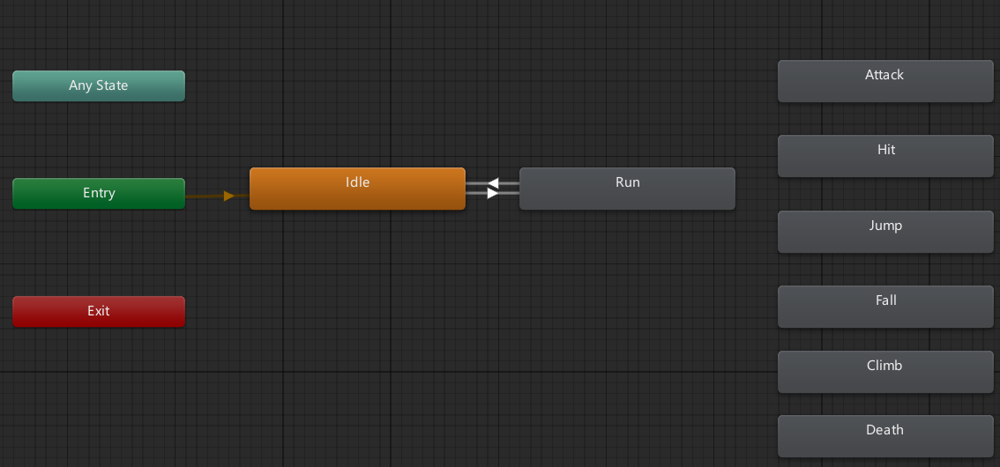

修改脚本：`Assets/Scripts/PlayerController`，控制参数`Running`的变化，以及角色的朝向

```c#
void Run() {
    // 通过刚体组件, 控制角色移动
    float moveDir = Input.GetAxis("Horizontal"); // 水平方向的移动
    Vector2 playerVelocity = new Vector2(moveDir * runSpeed, rigidbody.velocity.y);
    rigidbody.velocity = playerVelocity;

    // 控制动画的切换
    bool playerHasXAxisSpeed = Mathf.Abs(rigidbody.velocity.x) > Mathf.Epsilon;
    animator.SetBool("Run", playerHasXAxisSpeed);
    animator.SetBool("Idle", !playerHasXAxisSpeed);

    // 控制是否需要翻转角色
    if (playerHasXAxisSpeed) {
        if (rigidbody.velocity.x > 0.1f) {
            transform.localRotation = Quaternion.Euler(0, 0, 0);
        }
        if (rigidbody.velocity.x < -0.1f) {
            transform.localRotation = Quaternion.Euler(0, 180, 0);
        }
    }
}
```

# 04、角色：跳跃

设置地面的layer为：`Ground`

修改脚本：`Assets/Scripts/PlayerController`

```c#
void Jump() {
    if (Input.GetButtonDown("Jump") && IsGrounded()) {
        Vector2 jumpVelocity = new Vector2(0.0f, jumpSpeed);
        rigidbody.velocity = Vector2.up * jumpVelocity;
    }
}

bool IsGrounded() {
    return feetCollider.IsTouchingLayers(LayerMask.GetMask("Ground"));
}
```

# 05、角色：跳跃动画

修改角色的Animator：

- Idle => Jump：参数`Jump`为`true`
- Jump => Fall：参数`Jump`为`false`，参数`Fall`为`true`
- Fall => Idle：参数`Fall`为`false`，参数`Idle`为`true`
- Run => Jump：参数`Jump`为`true`
- Fall => Run：参数`Fall`为`false`，参数`Run`为`true`

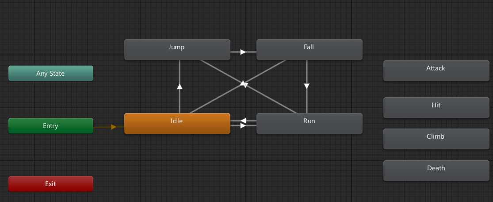

修改脚本：`Assets/Scripts/PlayerController`

```c#
void Jump() {
    if (Input.GetButtonDown("Jump") && IsGrounded()) {
        // 通过刚体组件, 控制角色跳跃
        Vector2 jumpVelocity = new Vector2(0.0f, jumpSpeed);
        rigidbody.velocity = Vector2.up * jumpVelocity;

        // 控制动画的切换
        animator.SetBool("Jump", true);
    }

    // 纵向速度小于0, 表示角色正在下落
    if(rigidbody.velocity.y < 0.0f) {
        animator.SetBool("Jump", false);
        animator.SetBool("Fall", true);
    }

    // 角色落地后, 重置动画
    if(IsGrounded()) {
        animator.SetBool("Fall", false);
    }
}
```

# 06、角色：二段跳

修改角色的Animator：

- Fall => Jump：参数`Jump`为`true`

> 由于二段跳动画和一段跳相同，因此没有添加二段跳的状态机

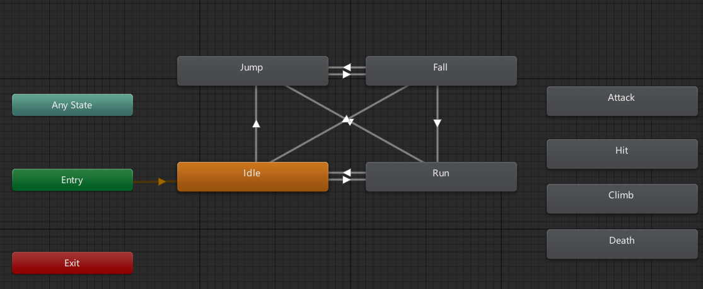

修改脚本：`Assets/Scripts/PlayerController`

```c#
void Jump() {
    if (Input.GetButtonDown("Jump")) {
        // 在地面上, 进行一段跳
        if (IsGrounded()) {
            // 通过刚体组件, 控制角色跳跃
            Vector2 jumpVelocity = new Vector2(0.0f, jumpSpeed);
            rigidbody.velocity = Vector2.up * jumpVelocity;

            // 可以进行二段跳
            canDoubleJump = true;
        
            // 控制动画的切换
            animator.SetBool("Jump", true);
            animator.SetBool("Fall", false);
        } 
        // 在空中, 但可以进行二段跳
        else if (canDoubleJump) {
            Vector2 doubleJumpVelocity = new Vector2(0.0f, doubleJumpSpeed);
            rigidbody.velocity = Vector2.up * doubleJumpVelocity;

            // 不可以进行二段跳
            canDoubleJump = false;

            // 控制动画的切换
            animator.SetBool("Jump", true);
            animator.SetBool("Fall", false);
        }
    }

    // 纵向速度小于0, 表示角色正在下落
    if(rigidbody.velocity.y < 0.0f) {
        animator.SetBool("Jump", false);
        animator.SetBool("Fall", true);
    }

    // 角色落地后, 重置动画
    if(IsGrounded()) {
        animator.SetBool("Fall", false);
    }
}
```

# 07、角色攻击：动画

添加按键：`编辑|项目设置|输入管理器`

- 修改大小为：`19`
- 添加按键：`Attack`，肯定按钮为`j`

修改角色的Animator：

- Any State => Attack：触发器`Attack`
- Attack => Idle：参数`Idle`为`true`，参数`Jump`为`false`，参数`Fall`为`false`，**有退出时间**
- Attack => Run：参数`Run`为`true`，参数`Jump`为`false`，参数`Fall`为`false`，**有退出时间**
- Attack => Jump：参数`Jump`为`true`，**有退出时间**
- Attack => Fall：参数`Fall`为`true`，**有退出时间**

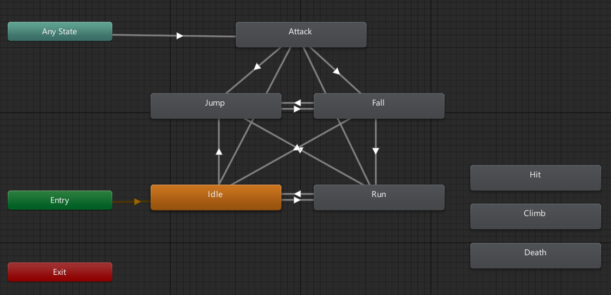

修改脚本：`Assets/Scripts/PlayerController`

```c#
private bool canAttack = true; // 角色是否可以攻击

void Attack() {
    // 由于控制了最短攻击间隔为0.5s, 因此可以长按攻击键持续攻击
    if(Input.GetButton("Attack") && canAttack) {
        animator.SetTrigger("Attack");
        canAttack = false;
        Invoke("AttackReset", 0.5f);
    }
}

void AttackReset() {
    canAttack = true;
}
```

# 08、角色攻击：HitBox

为角色添加子对象：`PlayerAttack`

为`PlayerAttack`添加组件：

- `Polygon Collider 2D`，用于表示角色的攻击范围
  - **是触发器**：勾选
  - **默认不显示**
- `PlayerAttack`：自定义脚本，控制角色攻击

添加脚本：`Assets/Scripts/PlayerAttack`，控制角色攻击

> 将上一节中的攻击相关函数，迁移到子物体中

```c#
public class PlayerAttack : MonoBehaviour {
    [Tooltip("角色攻击的伤害")]
    public int damage = 1;

    private Animator animator;
    private PolygonCollider2D collider;

    private bool canAttack = true; // 角色是否可以攻击

    void Start() {
        animator = transform.parent.GetComponent<Animator>();
        collider = GetComponent<PolygonCollider2D>();
    }

    void Update() {
        Attack();
    }
    
    void Attack() {
        // 由于控制了最短攻击间隔为0.5s, 因此可以长按攻击键持续攻击
        if (Input.GetButton("Attack") && canAttack) {
            animator.SetTrigger("Attack");
            canAttack = false;
            Invoke("AttackStart", 0.35f);
            Invoke("AttackReset", 0.5f);
        }
    }
    void AttackStart() {
        collider.enabled = true;
        Invoke("AttackEnd", 0.05f);
    }
    void AttackEnd() {
        collider.enabled = false;
    }
    void AttackReset() {
        canAttack = true;
    }
}
```

# 09、角色攻击：Enemy

敌人素材：`Assets/Sprite/Bat.png`

- **Sprite模式**：多个
- **每单位像素数**：16
- **过滤模式**：点（无过滤器）
- **压缩**：无

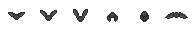

切割动画：

- 每个单元的尺寸：32×32像素

生成动画：

- 选择第1帧，拖入场景，生成原始人物`EnemyBat`
- 选择动画对应的多个序列帧，拖拽至人物身上，自动创建动画

设置`EnemyBat`的`Tag`为：Enemy

为角色添加组件

- `Box Collider 2D`：碰撞体组件，用于表示蝙蝠的碰撞
  - **是触发器**：勾选
- `EnemyBat`：自定义脚本，用于控制蝙蝠

添加脚本：`Assets/Scripts/Enemy`，控制所有的敌人类

```c#
public class Enemy : MonoBehaviour {
    [Tooltip("敌人的血量")]
    public int health = 5;
    [Tooltip("敌人的伤害")]
    public int damage = 1;

    protected void Update() {
        if (health <= 0) {
            Destroy(gameObject);
        }
    }

    public void TakeDamage(int damage) {
        health -= damage;
    }
}

```

添加脚本：`Assets/Scripts/EnemyBat`，控制蝙蝠

```c#
public class EnemyBat : Enemy {
    protected void Start(){
        base.Start();
    }
    protected void Update(){
        base.Update();
    }
}
```

修改脚本：`Assets/Scripts/PlayerAttack`

```c#
private void OnTriggerEnter2D(Collider2D collision) {
    if(collision.gameObject.tag.Equals("Enemy")) {
        collision.gameObject.GetComponent<Enemy>().TakeDamage(damage);
    }
}
```

# 10、敌人：受伤后红色闪烁

原理：更改`Sprite Renderer`组件的`颜色`属性

修改脚本：`Assets/Scripts/Enemy`

```c#
public void TakeDamage(int damage) {
    health -= damage;

    // 受伤后红色闪烁
    spriteRenderer.color = Color.red;
    Invoke("ResetColor", flashTime);
}

void ResetColor() {
    spriteRenderer.color = originColor;
}
```

# 11、敌人：简单AI

功能：在一定范围内，飞到随机的位置

修改脚本：`Assets/Scripts/EnemyBat`

```c#
public class EnemyBat : Enemy {
    [Tooltip("敌人的移动速度")]
    public float speed = 2f;
    [Tooltip("敌人移动的等待时间")]
    public float startWaitTime = 1f;

    [Tooltip("敌人的移动范围: 左下角")]
    public Transform leftDownPosition;
    [Tooltip("敌人的移动范围: 右上角")]
    public Transform rightUpPosition;

    private float waitTime;             // 敌人移动的等待时间
    private Vector2 targetPosition;     // 敌人移动的目标位置
    protected void Start() {
        base.Start();
        waitTime = startWaitTime;
        targetPosition = GetRandomPosition();
    }

    protected void Update() {
        base.Update();

        transform.position = Vector2.MoveTowards(transform.position, targetPosition, speed * Time.deltaTime);
        if(Vector2.Distance(transform.position, targetPosition) < 0.1f) {
            if (waitTime <= 0) {
                targetPosition = GetRandomPosition();
                waitTime = startWaitTime;
            } else {
                waitTime -= Time.deltaTime;
            }
        }
    }

    Vector2 GetRandomPosition() {
        return new Vector2(
            Random.Range(leftDownPosition.position.x, rightUpPosition.position.x),
            Random.Range(leftDownPosition.position.y, rightUpPosition.position.y)
        );
    }
}
```

# 12、敌人：受伤粒子特效

新建粒子系统，重命名为`BloodEffect`，并创建预制体

- **旋转**：(90, 0, 0)
- **渲染器**：
  - **材质**：Sprite-Default
- **Particle System**：
  - **起始速度**：3
  - **起始颜色**：红色
  - **循环播放**：取消勾选
  - **持续时间**：1
  - **起始生命周期**：0.5
  - **起始大小**：0.1
  - **重力修改器**：0.5
  - **模拟速度**：2
- **形状**：
  - **角度**：0
  - **半径**：0.5
- 添加自定义脚本：`BloodEffect`

新建脚本：`Assets/Scripts/BloodEffect`

```c#
public class BloodEffect : MonoBehaviour {
    [Tooltip("销毁时间")]
    public float timeToDestroy = 1f;
    void Start() {
        Destroy(gameObject, timeToDestroy);
    }
}
```

修改脚本：`Assets/Scripts/Enemy`

```c#
public GameObject bloodEffect;

public void TakeDamage(int damage) {
    health -= damage;

    // 受伤后红色闪烁
    spriteRenderer.color = Color.red;
    Invoke("ResetColor", flashTime);

    // 受伤后, 生成粒子效果
    Instantiate(bloodEffect, transform.position, Quaternion.identity);
}
```

# 13、相机：跟随 CameraFollow

新建空对象：`CameraFollow`，将相机作为其子对象

- 添加自定义脚本：`CameraFollow`，控制相机跟随

新建脚本：`Assets/Scripts/CameraFollow`

```c#
public class CameraFollow : MonoBehaviour {
    [Tooltip("相机跟随的目标")]
    public Transform target;
    [Tooltip("平滑值"), Range(0, 1)]
    public float smoothing = 0.1f;

    private void LateUpdate() {
        if (target == null) return;

        // 通过插值的方式, 让相机移动到目标位置
        if (transform.position != target.position) {
            transform.position = Vector3.Lerp(transform.position, target.position, smoothing);
        }
    } 
}
```

# 14、相机：震动 CameraShake

新建空对象：`CameraShake`

- 添加自定义脚本：`CameraShake`
- 设置Tag为：`CameraShake`，便于后续查找

新建动画器控制器：`Assets/Animation/MainCamera/MainCamera.controller`

新建动画：`Assets/Animation/MainCamera/Idle`

新建动画：`Assets/Animation/MainCamera/Shake`

- 进入`动画`面板录制动画：相机左右移动

修改`MainCamera.controller`的状态机

- Idle => Shake：触发器`Shake`
- Shake => Idle：退出时间0.5s，过渡时间0.25s

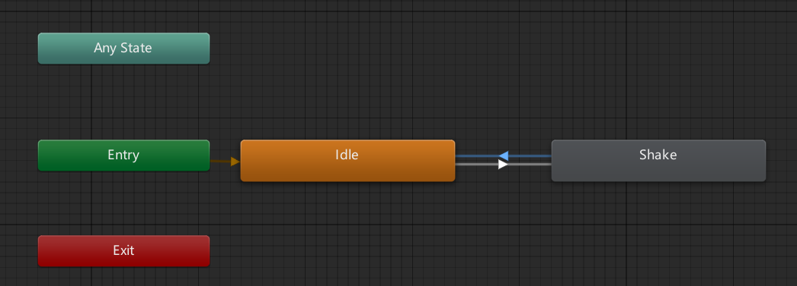

为`Camera`添加`Animator`组件

- 控制器设置为：`MainCamera.controller`

新建脚本：`Assets/Scripts/CameraShake`

```c#
public class CameraShake : MonoBehaviour {
    [Tooltip("相机的动画组件")]
    public Animator cameraAnimator;
    
    void Start() {
        GameController.cameraShake = GameObject.FindGameObjectWithTag("CameraShake").GetComponent<CameraShake>();
    }
    
    public void Shake() {
        cameraAnimator.SetTrigger("Shake");
    }
}
```

新建脚本：`Assets/Scripts/GameController`，用于存放全局静态变量

```c#
public class GameController : MonoBehaviour {
    [Tooltip("相机抖动组件")]
    public static CameraShake cameraShake;
}
```

修改脚本：`Assets/Scripts/Enemy`

```c#
public void TakeDamage(int damage) {
    health -= damage;

    // 受伤后红色闪烁
    spriteRenderer.color = Color.red;
    Invoke("ResetColor", flashTime);

    // 受伤后, 生成粒子效果
    Instantiate(bloodEffect, transform.position, Quaternion.identity);

    // 受伤后, 相机抖动
    GameController.cameraShake.Shake();
}
```

# 15、相机：限制移动范围

修改脚本：`Assets/Scripts/CameraFollow`

```c#
[Tooltip("相机的最小位置")]
public Vector2 minPosition;
[Tooltip("相机的最大位置")]
public Vector2 maxPosition;

private void LateUpdate() {
    if (target == null) return;

    if (transform.position != target.position) {
        Vector3 targetPosition = target.position;
        // 限定相机的移动范围
        targetPosition.x = Mathf.Clamp(targetPosition.x, minPosition.x, maxPosition.x);
        targetPosition.y = Mathf.Clamp(targetPosition.y, minPosition.y, maxPosition.y);
        // 通过插值的方式, 让相机移动到目标位置
        transform.position = Vector3.Lerp(transform.position, targetPosition, smoothing);
    }
}

public void SetCameraPositionLimit(Vector2 minPos, Vector2 maxPos) {
    minPosition = minPos;
    maxPosition = maxPos;
}
```

# 16、角色：受伤闪烁

为`Player`添加自定义脚本：`PlayerHealth`

新建脚本：`Assets/Scripts/PlayerHealth`，用于控制角色血量

```c#
public class PlayerHealth : MonoBehaviour {
    [Tooltip("玩家的生命值")]
    public int health = 5;
    [Tooltip("玩家受到伤害后闪烁的次数")]
    public int numBlinks = 2;
    [Tooltip("玩家受到伤害后闪烁的时间")]
    public float seconds = 0.1f;

    private Renderer playerRenderer;    // 玩家的 Renderer 组件
    
    void Start() {
        playerRenderer = GetComponent<Renderer>();
    }
    
    public void TakeDamage(int damage) {
        health -= damage;

        if (health <= 0) {
            Destroy(gameObject);
            return;
        }

        // 受伤后闪烁
        BlinkPlayer(numBlinks, seconds);
    }

    void BlinkPlayer(int numBlinks, float seconds) {
        StartCoroutine(DoBlinks(numBlinks, seconds));
    }
    IEnumerator DoBlinks(int numBlinks, float seconds) {
        for(int i = 0; i < numBlinks * 2; i++) {
            playerRenderer.enabled = !playerRenderer.enabled;
            yield return new WaitForSeconds(seconds);
        }
        playerRenderer.enabled = true;
    }
}
```

修改脚本：`Assets/Scripts/Enemy`

```c#
private PlayerHealth playerHealth;      // 玩家的生命值组件

private void OnTriggerEnter2D(Collider2D collision) {
    // 如果敌人与玩家碰撞, 并且玩家的碰撞器是胶囊体碰撞器
    if(collision.gameObject.tag == "Player" && collision.GetType().ToString() == "UnityEngine.CapsuleCollider2D") {
        if(playerHealth != null) {
            playerHealth.TakeDamage(damage);
        }
    }
}
```

# 17、角色：死亡

## 17.1	[BUG]角色跳跃至平台边缘后卡死

新建**2D|Physical Material 2D**，重命名为`PlayerFriction`

- 摩擦力设置为：`0`

将角色胶囊碰撞体的材质，设置为`PlayerFriction`

## 17.2	角色死亡

修改角色动画状态机

- Any State => Death：触发器`Death`

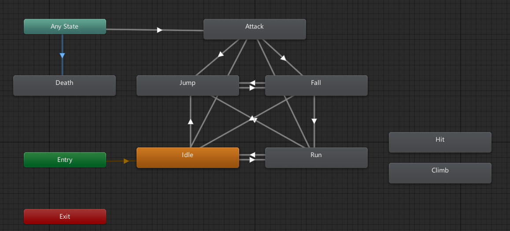

修改脚本：`PlayerHealth`

```c#
private Animator playerAnimator;    // 玩家的 Animator 组件

public void TakeDamage(int damage) {
    health -= damage;

    // 玩家死亡
    if (health <= 0) {
        playerAnimator.SetTrigger("Death");
        Invoke("KillPlayer", 0.9f);
        return;
    }

    // 受伤后闪烁
    BlinkPlayer(numBlinks, seconds);
}

void KillPlayer() {
    Destroy(gameObject);
}
```

# 18、Layer 和 Sorting Layer

- Layer 图层：处理**碰撞**相关
- Sorting Layer 排序图层：处理**显示**顺序

图层碰撞矩阵：**编辑|项目设置|2D 物理**

# 19、场景：2D Tile Map

原始瓦片资源：`Assets/Sprite/WallTile/WallTile0~2.png`

- **每单位像素数**：16
- **过滤模式**：点（无过滤器）
- **压缩**：无

创建**平铺调色板**，重命名为`MyPalette`

- 将上述三个瓦片资源的Sprite，拖入平铺调色板中

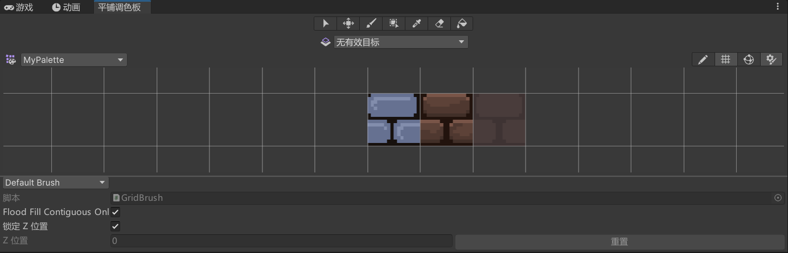

创建**2D对象|瓦片地图|矩形**

- `Grid`的子对象，即为`TileMap`
- 再创建一个`TileMap`，分别对应`ForeGround`和`BackGround`
  - 设置各自的图层、排序图层
  - 在调色板中选中瓦片，即可绘制
- 为`ForeGround`添加组件
  - `Tilemap Collider 2D`：添加碰撞功能
    - **由复合使用**：勾选
  - `Composite Collider 2D`：将碰撞体合并到一起
  - `Rigid Body 2D`：添加Composite Collider 2D时默认添加
    - **身体类型**：静态

# 20、UI：角色血量条

原始血条资源：`Assets/Sprite/Player/HP_MP_Bar.png`

- **Sprite模式**：多个
- **每单位像素数**：16
- **过滤模式**：点（无过滤器）
- **压缩**：无

切割动画：

- 自动切割

新建**UI|画布**，在其下新建

- **UI|图像**，重命名为`HealthBar`
  - **源图像**：`HP_MP_Bar_0`
  - 添加自定义脚本：`UIHealthBar`
- **UI|图像**，重命名为`Health`
  - **源图像**：`HP_MP_Bar_1`
  - **图像类型**：已填充
  - **填充方法**：水平
  - **填充原点**：左
- **UI|文本**，重命名为`HealthText`

新建脚本：`UIHealthBar`

```c#
public class UIHealthBar : MonoBehaviour {
    [Tooltip("生命值文本UI组件")]
    public Text healthText;
    [Tooltip("血量条UI组件")]
    public Image healthBar;

    [Tooltip("角色当前血量")]
    public static int HealthCurrent;
    [Tooltip("角色最大血量")]
    public static int HealthMax;

    void Update() {
        healthBar.fillAmount = (float)HealthCurrent / HealthMax;
        healthText.text = HealthCurrent.ToString() + "/" + HealthMax.ToString();
    }
}
```

修改脚本：`PlayerHealth`

```c#
void Start() {
    playerRenderer = GetComponent<Renderer>();
    playerAnimator = GetComponent<Animator>();

    // 初始化血量条
    UIHealthBar.HealthMax = health;
    UIHealthBar.HealthCurrent = health;
}

public void TakeDamage(int damage) {
    // 更新血量
    health -= damage;
    if (health <= 0) health = 0;
    
    // 更新血量条
    UIHealthBar.HealthCurrent = health;

    // 玩家死亡
    if (health <= 0) {
        playerAnimator.SetTrigger("Death");
        Invoke("KillPlayer", 0.9f);
        return;
    }

    // 受伤后闪烁
    BlinkPlayer(numBlinks, seconds);
}
```

# 21、UI：角色受伤屏幕红闪

## 21.1	屏幕红闪

新建**UI|图像**，重命名为`ScreenFlash`

- **颜色**： FF0000，透明度设置为0
- **锚点**：设置为四周，并将位置均设置为0

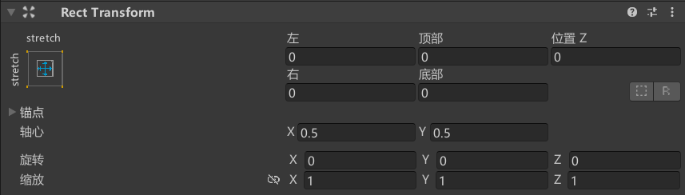

新建脚本`UIScreenFlash`，挂载到`Player`上

```c#
public class UIScreenFlash : MonoBehaviour {
    [Tooltip("屏幕红闪对应的Image组件")]  
    public Image image;
    [Tooltip("屏幕红闪的持续时间")]
    public float flashTime = 0.1f;

    private Color flashColor;   // 红闪的颜色
    private Color defaultColor; // 默认的颜色

    void Start() {
        defaultColor = image.color;
        flashColor = new Color(1.0f, 0.0f, 0.0f, 1.0f);
    }

    
    public void FlashScreen() {
        StartCoroutine(Flash());
    }
    IEnumerator Flash() {
        image.color = flashColor;
        yield return new WaitForSeconds(flashTime);
        image.color = defaultColor;
    }
}
```

修改脚本：`PlayerHealth`

```c#
public void TakeDamage(int damage) {
    // 更新血量
    health -= damage;
    if (health <= 0) health = 0;
    
    // 更新血量条
    UIHealthBar.HealthCurrent = health;

    // 玩家死亡
    if (health <= 0) {
        playerAnimator.SetTrigger("Death");
        Invoke("KillPlayer", 0.9f);
        return;
    }

    // 受伤后闪烁
    BlinkPlayer(numBlinks, seconds);
    // 屏幕红闪
    uiScreenFlash.FlashScreen();
}
```

## 21.1	[BUG]角色死亡后仍能移动

修改脚本：`GameController`

```c#
public class GameController : MonoBehaviour {
    [Tooltip("相机抖动组件")]
    public static CameraShake cameraShake;
    [Tooltip("玩家是否存活")]
    public static bool isPlayerAlive = true;
}
```

修改脚本：`PlayerController`

```c#
void Update() {
    if (!GameController.isPlayerAlive) return;
    Run();
    Jump();
}
```

修改脚本：`PlayerHealth`

```c#
public void TakeDamage(int damage) {
    // 更新血量
    health -= damage;
    if (health <= 0) health = 0;
    
    // 更新血量条
    UIHealthBar.HealthCurrent = health;

    // 玩家死亡
    if (health <= 0) {
        playerAnimator.SetTrigger("Death");
        GameController.isPlayerAlive = false;
        // 玩家死亡后, 不能移动, 不能受重力影响
        rigidbody.velocity = Vector2.zero;
        rigidbody.gravityScale = 0;
        // 玩家死亡后, 0.9s 后销毁角色
        Invoke("KillPlayer", 0.9f);
        return;
    }

    // 受伤后闪烁
    BlinkPlayer(numBlinks, seconds);
    // 屏幕红闪
    uiScreenFlash.FlashScreen();
}
```

# 22、场景：地刺陷阱

地刺素材：`Assets/Sprite/ForeGround/Spike`

- **每单位像素数**：16
- **过滤模式**：点（无过滤器）
- **压缩**：无
- 进入**Sprite编辑器**，修改**Custom Physics Shape**，将碰撞体画在地刺上

将素材拖入平铺调色板中，创建`tilemap`

创建**2D对象|瓦片地图|矩形**

- **排序图层**：ForeGround
- **图层**：Spike
- 添加组件：
  - `Tilemap Collider 2D`：添加碰撞功能
    - **由复合使用**：勾选
  - `Composite Collider 2D`：将碰撞体合并到一起
    - **是触发器**：勾选
  - `Rigid Body 2D`：添加Composite Collider 2D时默认添加
    - **身体类型**：静态
  - `Spike`：自定义脚本

新建脚本：`Spike`

```c#
public class Spike : MonoBehaviour {
    [Tooltip("尖刺的伤害")]
    public int damage = 1;

    private PlayerHealth playerHealth;  // 玩家的生命值组件

    void Start() {
        playerHealth = GameObject.FindGameObjectWithTag("Player").GetComponent<PlayerHealth>();
    }

    private void OnTriggerEnter2D(Collider2D collision) {
        if (collision.gameObject.tag == "Player" && collision.GetType().ToString() == "UnityEngine.PolygonCollider2D") {
            if (playerHealth != null) {
                // 玩家受到伤害
                playerHealth.TakeDamage(damage);
            }
        }
    }
}
```

为`Player`添加一个`Polygon Collider 2D`：用于对角色造成伤害

修改脚本：`PlayerHealth`

```c#
public void TakeDamage(int damage) {
    // 更新血量
    health -= damage;
    // 禁用碰撞体, 实现短暂无敌效果
    polygonCollider2D.enabled = false;
    if (health <= 0) health = 0;
    
    // 更新血量条
    UIHealthBar.HealthCurrent = health;

    // 玩家死亡
    if (health <= 0) {
        playerAnimator.SetTrigger("Death");
        GameController.isPlayerAlive = false;
        // 玩家死亡后, 不能移动, 不能受重力影响
        rigidbody.velocity = Vector2.zero;
        rigidbody.gravityScale = 0;
        // 玩家死亡后, 0.9s 后销毁角色
        Invoke("KillPlayer", 0.9f);
        return;
    }

    // 受伤后闪烁
    BlinkPlayer(numBlinks, seconds);
    // 屏幕红闪
    uiScreenFlash.FlashScreen();
}

void BlinkPlayer(int numBlinks, float seconds) {
    StartCoroutine(DoBlinks(numBlinks, seconds));
}
IEnumerator DoBlinks(int numBlinks, float seconds) {
    for(int i = 0; i < numBlinks * 2; i++) {
        playerRenderer.enabled = !playerRenderer.enabled;
        yield return new WaitForSeconds(seconds);
    }
    playerRenderer.enabled = true;

    // 闪烁结束后一段时间, 恢复碰撞体
    yield return new WaitForSeconds(0.5f);
    polygonCollider2D.enabled = true;
}
```

